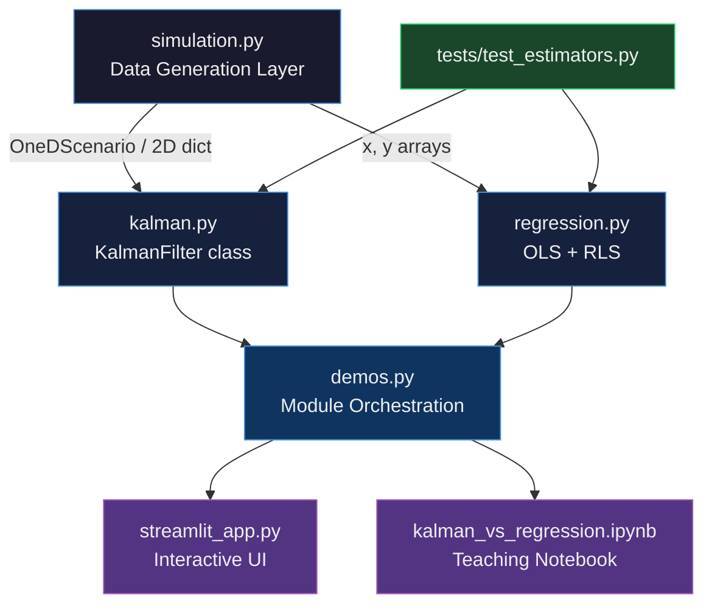
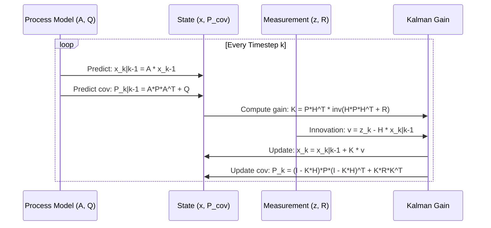
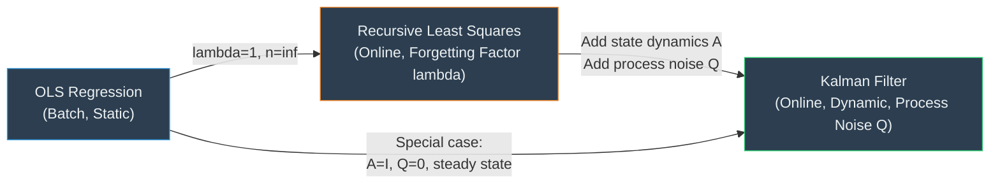
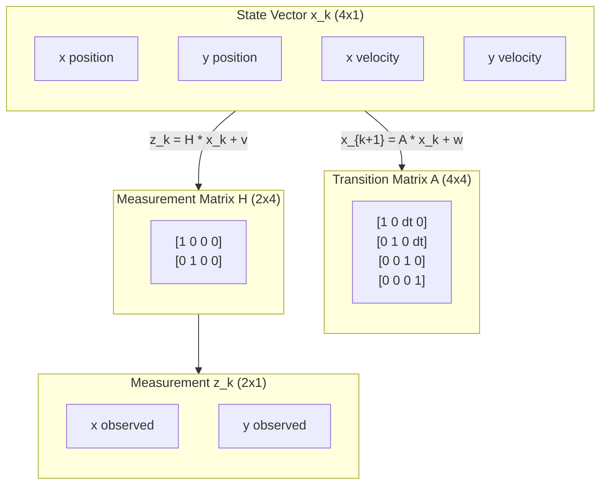
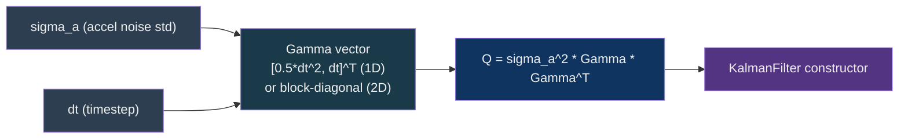

<div align="center">

# Kalman Regression Estimation Lab

[](https://www.python.org/)
[](https://numpy.org/)
[](https://scipy.org/)
[](https://scikit-learn.org/)
[](https://streamlit.io/)
[](https://jupyter.org/)
[](https://opensource.org/licenses/MIT)
[](https://pytest.org/)
[](https://github.com/psf/black)

**An educational and interactive laboratory for understanding the deep relationship between Kalman filtering and linear regression - two of the most foundational estimation algorithms in science and engineering.**

</div>

---

> [!NOTE]
> This project is designed as a progressive learning experience. Start with Module A to build intuition, then advance through Modules B, C, and D. Each module builds directly on concepts introduced in the previous one.

---

## Table of Contents

- [What This Project Is](#what-this-project-is)
- [Slope, Weights, and What They Actually Mean](#slope-weights-and-what-they-actually-mean)
- [How Kalman Is Genuinely Different From Regression](#how-kalman-is-genuinely-different-from-regression)
- [The Core Insight](#the-core-insight)
- [Quick Comparison: Regression vs Kalman](#quick-comparison-regression-vs-kalman)
- [When to Use What](#when-to-use-what)
- [Architecture Overview](#architecture-overview)
- [Algorithm Deep Dive](#algorithm-deep-dive)
- [Module Guide](#module-guide)
- [Tech Stack](#tech-stack)
- [Setup and Installation](#setup-and-installation)
- [Roadmap Status](#roadmap-status)
- [Running the Project](#running-the-project)
- [Nonlinear EKF/UKF Extension](#nonlinear-ekfukf-extension)
- [API Reference](#api-reference)
- [Project Structure](#project-structure)
- [Key Formulas](#key-formulas)
- [Citations and Further Reading](#citations-and-further-reading)

---

## What This Project Is

The **Kalman Regression Estimation Lab** is an educational codebase that bridges two worlds that are often taught in complete isolation from each other: classical statistical regression and recursive state estimation via the Kalman filter. Both methods answer the same fundamental question - "given noisy data, what is our best estimate of some underlying quantity?" - but they approach it from entirely different philosophical directions and with very different assumptions about the nature of the data generating process.

Linear regression treats the world as static. It assumes that some fixed set of parameters (slope, intercept) generated the data you observed, and it tries to recover those parameters by minimising a global loss function over the entire dataset at once. This is the "batch" mindset: collect everything, then solve. It is elegant, fast, and analytically tractable, but it fundamentally cannot represent the idea that the underlying system is changing over time.

The Kalman filter treats the world as dynamic. It assumes a process model that evolves through time and a measurement model that maps the hidden state to observable quantities, each corrupted by Gaussian noise. Instead of solving a global problem once, it processes one observation at a time and maintains a probability distribution (a mean vector and a covariance matrix) over the current state. This is the "online" or "recursive" mindset: update your belief as each new piece of evidence arrives.

What makes this project interesting is that these two approaches are not opposites - they are deeply unified. Under specific conditions (stationary state, linear model, Gaussian noise), the steady-state Kalman gain converges to exactly the solution you would get from ordinary least squares. Understanding this connection gives you profound insight into why both algorithms work and when you should prefer one over the other.

---

## Slope, Weights, and What They Actually Mean

The **slope** in linear regression is the single number that answers: "if x goes up by 1, how much does y go up?" That is it. If your data is `(hours_studied, exam_score)` and the slope is `4.2`, it means each extra hour of studying predicts 4.2 more points on the exam. The **intercept** is what the model predicts when x is zero.

Formally: $\hat{y} = \text{slope} \times x + \text{intercept}$

Regression finds the slope and intercept that minimise the total squared error across every data point - that optimisation is done once, over the whole dataset, and then the slope is frozen forever.

### Wait - so how is that different from a transformer weight matrix?

Great question. They are the same idea at different scales and with very different training procedures.

In a transformer, the weight matrix $W$ in a linear layer does exactly what slope does - it scales and rotates an input vector to produce an output vector. The operation `y = W @ x` is just slope applied to every dimension simultaneously. A matrix is just a slope for vectors.

The difference is:

| | Linear Regression | Transformer Weight Matrix |
|---|---|---|
| What it maps | one number x to one number y | a vector of 512+ numbers to another vector |
| How slope/weight is found | closed-form normal equations - one shot | gradient descent over millions of examples - many passes |
| Number of "slopes" | 1 (or p for multi-feature) | millions to billions |
| What the weight encodes | one linear relationship in your data | a learned feature transformation - no human-readable meaning |
| After training, does it change? | No - frozen | No - frozen (at inference time) |
| Can it represent non-linearity? | No | Yes - via activation functions between layers |

So when a transformer processes a sentence, every attention layer and every feed-forward layer is doing `output = W @ input + b` - which is structurally identical to `y = slope * x + intercept`. The weights ARE slopes. Billions of them, stacked, with non-linearities between layers so the whole thing can represent arbitrarily complex functions.

Regression is just a transformer with one layer, one neuron, and no activation function.

> [!NOTE]
> This is why linear regression is taught first. It is the atomic unit of every neural network. Understanding what slope means, how it is found, and what residuals tell you gives you the intuition for why gradient descent works, what loss functions represent, and why overfitting happens.

### The slope in code

```python
from src.kalman_regression_estimation_lab.regression import fit_static_linear_regression
import numpy as np

x = np.array([1, 2, 3, 4, 5], dtype=float)
y = np.array([2.1, 3.9, 6.2, 7.8, 10.1], dtype=float)  # roughly y = 2x + 0

result = fit_static_linear_regression(x, y)
print(f"Slope:     {result['slope']:.4f}")      # ~2.0  - each unit of x adds this much to y
print(f"Intercept: {result['intercept']:.4f}")  # ~0.0  - predicted y when x=0
print(f"RMSE:      {result['rmse']:.4f}")       # how wrong the line is on average
```

The slope says: "the best single linear relationship I found in this data". Nothing more. It knows nothing about whether x=3 came before x=4, it knows nothing about velocity, it cannot tell you what y will be at x=6 beyond a straight extrapolation.

---

## How Kalman Is Genuinely Different From Regression

This is the question that actually matters. Not "static vs dynamic" - that description is too vague to be useful. Here is the real answer.

### Regression answers: "what line fits this pile of data?"

You dump all your observations in. It finds one set of weights (slopes) that minimise total squared error. The output is a frozen model. It treats every observation as equal, orderless, timeless. Observation 47 is no more recent than observation 3 - they are just two rows in a matrix.

This is incredibly powerful for AI/ML. Training a neural network IS regression at its core - you are finding weights that map inputs to outputs across a training set.

### Kalman answers: "where is this thing right now, given physics and a noisy sensor?"

Kalman does not care about fitting a line. It answers a completely different question. It does three things regression fundamentally cannot do:

**1. It encodes physics.** You write down the equations of motion. `position_next = position_now + velocity * dt`. This is not learned from data - you put it in as prior knowledge. Regression has no such mechanism. It only knows what the data tells it.

**2. It tracks uncertainty in real time.** Kalman carries a covariance matrix `P` that represents "how uncertain am I about the current state, right now." Every time a new measurement arrives, `P` shrinks. Every time a step passes without a measurement, `P` grows (because the system could have drifted). Regression computes one confidence interval after training is done - it cannot grow and shrink in real time as evidence arrives.

**3. It estimates quantities that were never measured.** A GPS gives you position. Kalman gives you velocity too - by inferring it from the physics model across multiple position readings. Regression can only predict outputs it was trained to predict. You cannot train regression to output velocity if velocity was never in your training labels.

### The concrete illustration

```python
from src.kalman_regression_estimation_lab.simulation import simulate_1d_motion
from src.kalman_regression_estimation_lab.kalman import run_kalman_1d
from src.kalman_regression_estimation_lab.regression import fit_time_regression
import numpy as np

# Simulate a moving object - we only observe noisy position
scenario = simulate_1d_motion(n_steps=180, maneuver_step=90, maneuver_accel=0.8)

# --- Regression approach ---
# Give it all the noisy position readings, ask it to fit a line through time
reg_pred = fit_time_regression(scenario.t, scenario.measured_position)
# Result: one straight line through everything.
# When the object maneuvers at t=90, regression has no idea - it just draws a line.
# It CANNOT estimate velocity.

# --- Kalman approach ---
results = run_kalman_1d(
    z=scenario.measured_position,
    dt=1.0,
    process_accel_std=0.2,
    measurement_std=2.0,
    x0=0.0,
    v0=1.0,
)
# results["est"][:, 0]  - estimated position at every timestep
# results["est"][:, 1]  - estimated VELOCITY - never directly observed, inferred from physics
# results["gain"]       - how much Kalman trusted the sensor vs the physics model each step
```

At `t=90` when the object suddenly accelerates, regression does not react at all - it already fit its line. Kalman detects the innovation (the difference between predicted and measured position is suddenly large), increases uncertainty, and tracks through the maneuver. The Kalman gain `K` automatically shifts toward trusting the measurements more when the model predictions are off.

### Why both are in this project

The mathematical connection is this: if you take the Kalman filter and set the state transition to identity (`A = I`, meaning "the state does not evolve") and set process noise to zero (`Q = 0`, meaning "I am certain nothing changes"), the Kalman update equation becomes mathematically identical to the recursive least squares update - which converges to the OLS normal equations. Regression is a degenerate special case of Kalman where you assert there are no dynamics.

Understanding this tells you exactly when to escalate from regression to Kalman: the moment you need to track something that moves according to known physics, estimate quantities you never measured, or maintain a real-time uncertainty estimate.

---

## The Core Insight

> [!IMPORTANT]
> The Kalman filter IS a generalisation of linear regression. When the state transition matrix **A = I** (identity, no dynamics), the system does not evolve over time, and the Kalman filter reduces to a recursive least-squares estimator - which converges to the OLS solution. This is not a coincidence; it is a mathematical identity.

The bridge between the two methods is the **Recursive Least Squares (RLS)** algorithm, which is implemented in this project as an explicit intermediate step. RLS processes samples one at a time and updates its parameter estimate using the exact same gain-weighted correction step that the Kalman filter uses. The only difference is that Kalman adds a process noise term **Q** that allows the state to drift, and a full state-transition model **A** that encodes known physics.

---

## Quick Comparison: Regression vs Kalman

The table below is the most important starting point for understanding when to reach for which tool. Read this carefully before diving into the code.

| # | <sub>Property</sub> | <sub>Linear Regression (OLS)</sub> | <sub>Recursive Least Squares (RLS)</sub> | <sub>Kalman Filter</sub> |
|---|---|---|---|---|
| 1 | <sub>Processing mode</sub> | <sub>Batch - all data at once</sub> | <sub>Online - one sample at a time</sub> | <sub>Online - one step at a time</sub> |
| 2 | <sub>State assumption</sub> | <sub>Parameters are fixed constants</sub> | <sub>Parameters can drift slowly</sub> | <sub>State evolves by known dynamics</sub> |
| 3 | <sub>Uncertainty output</sub> | <sub>Confidence intervals (static)</sub> | <sub>Covariance of parameter estimate</sub> | <sub>Full covariance matrix per step</sub> |
| 4 | <sub>Memory requirement</sub> | <sub>Must store all data</sub> | <sub>O(p^2) only, no raw data needed</sub> | <sub>O(n^2) state covariance only</sub> |
| 5 | <sub>Handles dynamics?</sub> | <sub>No - static fit only</sub> | <sub>Weakly via forgetting factor</sub> | <sub>Yes - explicit physics model (A)</sub> |
| 6 | <sub>Requires process model?</sub> | <sub>No</sub> | <sub>No</sub> | <sub>Yes - must specify A, Q</sub> |
| 7 | <sub>Computational cost per step</sub> | <sub>O(np^2) total</sub> | <sub>O(p^2) per step</sub> | <sub>O(n^3) per step (matrix inv)</sub> |
| 8 | <sub>Optimal for what noise?</sub> | <sub>i.i.d. Gaussian</sub> | <sub>i.i.d. Gaussian + slow drift</sub> | <sub>Gaussian process + meas. noise</sub> |
| 9 | <sub>Can predict future state?</sub> | <sub>Extrapolates only</sub> | <sub>Extrapolates only</sub> | <sub>Yes - explicit predict step</sub> |
| 10 | <sub>Velocity/acceleration output?</sub> | <sub>No</sub> | <sub>No</sub> | <sub>Yes - full state vector</sub> |

> **Note:** "p" is the number of parameters, "n" is the state dimension. For the 2D tracker in this project, the state vector is [x, y, vx, vy] so n=4.

---

## When to Use What

Choosing the wrong estimator is one of the most common mistakes in applied engineering and data science. This decision guide will save you hours of debugging and poor results.

| # | <sub>Scenario</sub> | <sub>Best Choice</sub> | <sub>Why</sub> | <sub>Do NOT Use</sub> |
|---|---|---|---|---|
| 1 | <sub>Fitting a calibration curve to sensor data</sub> | <sub>OLS Regression</sub> | <sub>Static relationship, full data available</sub> | <sub>Kalman - overkill, requires dynamics model</sub> |
| 2 | <sub>Tracking a moving vehicle with GPS</sub> | <sub>Kalman Filter</sub> | <sub>State evolves in time, need velocity too</sub> | <sub>OLS - cannot track dynamics</sub> |
| 3 | <sub>Streaming price data, detect slow trend shift</sub> | <sub>RLS with forgetting</sub> | <sub>Online, parameters drift slowly</sub> | <sub>OLS - stale on concept drift</sub> |
| 4 | <sub>Fusing IMU + GPS measurements</sub> | <sub>Kalman / EKF</sub> | <sub>Multiple sensors, nonlinear dynamics</sub> | <sub>Regression - no sensor fusion</sub> |
| 5 | <sub>Predicting house prices from features</sub> | <sub>OLS or Ridge Regression</sub> | <sub>Static features, interpretable weights</sub> | <sub>Kalman - no meaningful dynamics</sub> |
| 6 | <sub>Estimating velocity from position sensors</sub> | <sub>Kalman Filter</sub> | <sub>Differentiating noisy signal needs filtering</sub> | <sub>Finite diff - amplifies noise catastrophically</sub> |
| 7 | <sub>Online learning with limited memory</sub> | <sub>RLS</sub> | <sub>No data storage needed, O(p^2)</sub> | <sub>OLS - requires storing all data</sub> |
| 8 | <sub>GNC / spacecraft attitude control</sub> | <sub>Kalman Filter</sub> | <sub>Hard real-time, known physics model</sub> | <sub>Neural net - not certifiable</sub> |

> [!TIP]
> A good rule of thumb: if you can write down the equations of motion (Newton's laws, kinematics, etc.), use a Kalman filter. If you have no dynamics model and just want the best static fit, use regression. If you have a stream of data and parameters that drift slowly, use RLS.

---

## Architecture Overview

The project is organised into four clearly separated layers: simulation, estimation, demonstration, and interface. This separation makes it easy to swap out individual components and compare results.



> **Architecture note:** The `demos.py` module is the glue layer. It calls simulation, estimation, and plotting in the correct order for each module scenario. Neither the Streamlit app nor the notebook contains estimation logic - they only call demo functions. This keeps the core algorithms clean and testable.

---

## Kalman Filter Predict-Update Cycle

The Kalman filter alternates between two steps every timestep. The predict step propagates the state forward using physics. The update step corrects the prediction using the new measurement. This diagram shows one full cycle.



> **Why the Joseph form?** The covariance update `P = (I - KH)P(I - KH)^T + KRK^T` is the numerically stable Joseph form. The simpler `P = (I - KH)P` is mathematically equivalent but can become non-positive-definite due to floating point errors over many iterations. The Joseph form is used in this implementation for robustness.

---

## RLS vs Kalman: Convergence Relationship

This diagram illustrates the conceptual relationship between the three estimators implemented in this project.



---

## Module Guide

Each module is a self-contained teaching scenario. They are designed to be studied in order.

### Module A - Static vs Dynamic Estimation

Module A is the foundation. It generates a simple 1D linear dataset (a straight line with Gaussian noise) and compares the OLS regression fit against a Kalman filter applied to the same data. The key observation is that regression produces a single global best-fit line, while Kalman produces a time-evolving estimate that converges from the initial uncertainty toward the true signal. This side-by-side comparison makes the difference between "fitting a curve" and "tracking a state" immediately visceral and intuitive.

The simulation uses `simulate_static_line()` which generates $y = 1.6x - 2.0 + \epsilon$ where $\epsilon \sim \mathcal{N}(0, 2.0)$ over 120 data points. The regression module fits this with OLS and returns the slope, intercept, predictions, residuals, RMSE, and 95% confidence intervals. The Kalman module applies a constant-velocity 1D tracker and shows how the posterior estimate and uncertainty evolve.

### Module B - Same Data, Three Lenses

Module B applies all three estimators (OLS, RLS, Kalman) to the same 1D motion trajectory generated by `simulate_1d_motion()`. This scenario includes a maneuver at step 90 where acceleration increases, creating a structural break. OLS fits a straight line through everything and misses the maneuver entirely. RLS with a forgetting factor of 0.98 slowly adapts to the new regime but lags. The Kalman filter, with its process noise model, tracks through the maneuver most accurately because it has a prior about how the state can change between steps.

This is the most instructive module for building intuition about the forgetting factor lambda in RLS - it is the RLS equivalent of the Kalman process noise Q.

### Module C - AI Context Decision Guide

Module C is not a numerical experiment but an interactive decision tree. Given a description of a problem (streaming vs batch, dynamics known vs unknown, real-time vs offline), it recommends the appropriate estimation strategy. This is aimed at AI practitioners who may be reaching for neural networks where a classical estimator would be more interpretable, more data-efficient, and more certifiable.

### Module D - GNC 2D Position and Velocity Tracking

Module D is the most complex and visually rich scenario. It simulates a 2D constant-velocity trajectory (as you might see in a drone, missile, or satellite tracker) and generates Monte Carlo clouds of noisy measurements around the true path. The 2D Kalman filter operates on a state vector $[x, y, v_x, v_y]^T$ with a 4x4 state transition matrix and 2x4 measurement matrix. The output includes the filtered position track, the estimated velocity, and the shrinking uncertainty ellipses as the filter gains confidence over time.

The GNC (Guidance, Navigation, and Control) framing is intentional - this is precisely the kind of problem Kalman filters were invented for (Rudolf Kalman's 1960 paper was motivated by the Apollo program navigation problem).

### Module E - Nonlinear EKF and UKF Extension

Module E is the roadmap extension that moves beyond linear measurement models. Instead of observing x/y position directly, the sensor now reports nonlinear radar-like measurements: **range** and **bearing**. That change breaks the assumptions of the linear Kalman filter and motivates two nonlinear alternatives.

The **Extended Kalman Filter (EKF)** linearizes the nonlinear measurement model with a Jacobian at each step and then applies the regular Kalman update equations. The **Unscented Kalman Filter (UKF)** avoids Jacobians and instead propagates deterministic sigma points through the nonlinear transform. In this project, both estimators are implemented for the same constant-velocity 2D state and compared against a naive range-bearing to Cartesian conversion baseline.

This module demonstrates the practical reason nonlinear filters matter: once your sensor geometry is nonlinear, simply converting measurements pointwise is often noisy and biased, while EKF/UKF can recover smoother and more accurate state trajectories by respecting process dynamics and uncertainty.

---

## State Transition and Measurement Model (2D Tracker)



> **Why constant-velocity?** The constant-velocity (CV) model is the simplest dynamic model that can represent realistic motion while remaining linear, which keeps the filter optimal (no linearisation needed). It is the standard baseline in tracking literature before moving to Singer models, interacting multiple models (IMM), or nonlinear variants.

---

## Algorithm Deep Dive

### Ordinary Least Squares (OLS)

OLS solves for the parameter vector $\hat{\beta}$ that minimises the sum of squared residuals over the entire dataset. The closed-form solution is the **normal equations**:

$$\hat{\beta} = (X^T X)^{-1} X^T y$$

This is a one-shot batch algorithm. It requires all $n$ observations to be available simultaneously and stores the full design matrix $X \in \mathbb{R}^{n \times p}$. It is the maximum likelihood estimator under the assumption of i.i.d. Gaussian noise and gives the minimum variance unbiased estimator (BLUE) by the Gauss-Markov theorem. Confidence intervals are computed using the $t$-distribution with $n-2$ degrees of freedom.

OLS is implemented in this project via `scikit-learn`'s `LinearRegression` (which uses LAPACK's `dgelsd` under the hood - a rank-revealing least squares solver that is numerically superior to naively inverting $X^T X$).

### Recursive Least Squares (RLS)

RLS maintains a running estimate $\hat{\theta}_k$ and a parameter covariance matrix $P_k$ and updates them as each new sample arrives:

$$K_k = \frac{P_{k-1} \phi_k}{\lambda + \phi_k^T P_{k-1} \phi_k}$$

$$\hat{\theta}_k = \hat{\theta}_{k-1} + K_k \left( y_k - \phi_k^T \hat{\theta}_{k-1} \right)$$

$$P_k = \frac{1}{\lambda} \left( P_{k-1} - K_k \phi_k^T P_{k-1} \right)$$

The **forgetting factor** $\lambda \in (0, 1]$ exponentially downweights old observations, giving the estimator a finite effective memory of $\frac{1}{1-\lambda}$ samples. When $\lambda = 1$, RLS converges to exactly the OLS solution given infinite data.

### Kalman Filter

The Kalman filter is a Bayesian recursive estimator for linear Gaussian state-space models. The complete cycle consists of two steps per timestep:

**Predict step:**
$$\hat{x}_{k|k-1} = A \hat{x}_{k-1|k-1}$$
$$P_{k|k-1} = A P_{k-1|k-1} A^T + Q$$

**Update step:**
$$K_k = P_{k|k-1} H^T \left( H P_{k|k-1} H^T + R \right)^{-1}$$
$$\hat{x}_{k|k} = \hat{x}_{k|k-1} + K_k \left( z_k - H \hat{x}_{k|k-1} \right)$$
$$P_{k|k} = (I - K_k H) P_{k|k-1} (I - K_k H)^T + K_k R K_k^T$$

The matrices used in this project are:

| # | <sub>Symbol</sub> | <sub>Dimension (2D tracker)</sub> | <sub>Name</sub> | <sub>Description</sub> |
|---|---|---|---|---|
| 1 | <sub>A</sub> | <sub>4 x 4</sub> | <sub>State transition matrix</sub> | <sub>Encodes constant-velocity kinematics</sub> |
| 2 | <sub>H</sub> | <sub>2 x 4</sub> | <sub>Measurement matrix</sub> | <sub>Maps state to observable (x, y only)</sub> |
| 3 | <sub>Q</sub> | <sub>4 x 4</sub> | <sub>Process noise covariance</sub> | <sub>Uncertainty in the dynamics model</sub> |
| 4 | <sub>R</sub> | <sub>2 x 2</sub> | <sub>Measurement noise covariance</sub> | <sub>Sensor noise level</sub> |
| 5 | <sub>K</sub> | <sub>4 x 2</sub> | <sub>Kalman gain</sub> | <sub>Blending weight between prediction and measurement</sub> |
| 6 | <sub>P</sub> | <sub>4 x 4</sub> | <sub>State error covariance</sub> | <sub>Posterior uncertainty of state estimate</sub> |
| 7 | <sub>x</sub> | <sub>4 x 1</sub> | <sub>State vector</sub> | <sub>[x, y, vx, vy] - position and velocity</sub> |
| 8 | <sub>z</sub> | <sub>2 x 1</sub> | <sub>Measurement vector</sub> | <sub>Observed (noisy) x and y positions</sub> |

---

## Process Noise Matrix Construction

The process noise matrix $Q$ is constructed from the discrete-time noise input matrix $\Gamma$ and the scalar acceleration noise variance $\sigma_a^2$:



> [!TIP]
> Tuning **Q** is often the hardest part of Kalman filter design. Too small a Q makes the filter over-confident in its dynamics model and slow to respond to manoeuvres. Too large a Q makes it trust measurements too much and act like a noisy low-pass filter. A useful starting rule: set $\sigma_a$ to roughly the maximum acceleration you expect the system to undergo between steps.

---

## Tech Stack

The table below explains every dependency, why it was chosen, and what would happen if you replaced it.

| # | <sub>Package</sub> | <sub>Version</sub> | <sub>Role in this project</sub> | <sub>Why this, not something else</sub> |
|---|---|---|---|---|
| 1 | <sub>NumPy</sub> | <sub>1.24+</sub> | <sub>All matrix operations, state vectors, covariance matrices</sub> | <sub>Zero-overhead array ops; Kalman math maps directly to numpy linalg</sub> |
| 2 | <sub>SciPy</sub> | <sub>1.11+</sub> | <sub>t-distribution for OLS confidence intervals (stats.t.ppf)</sub> | <sub>Provides exact t-quantiles; computing these from scratch is error-prone</sub> |
| 3 | <sub>scikit-learn</sub> | <sub>1.3+</sub> | <sub>LinearRegression wrapper for OLS</sub> | <sub>Numerically stable LAPACK-backed solver; consistent API</sub> |
| 4 | <sub>Matplotlib</sub> | <sub>3.7+</sub> | <sub>All static plots in demos and notebook</sub> | <sub>Full control over uncertainty ellipses and annotation</sub> |
| 5 | <sub>Streamlit</sub> | <sub>1.28+</sub> | <sub>Interactive web app with parameter sliders</sub> | <sub>Zero-boilerplate web UI for numerical apps; no JavaScript needed</sub> |
| 6 | <sub>Jupyter</sub> | <sub>latest</sub> | <sub>Teaching notebook with inline plots</sub> | <sub>Narrative + code in one document; standard in education</sub> |
| 7 | <sub>pytest</sub> | <sub>7+</sub> | <sub>Unit tests for estimator correctness</sub> | <sub>Lightweight, excellent fixtures, readable output</sub> |

> [!NOTE]
> There is no deep learning dependency (PyTorch, TensorFlow, JAX) in this project by design. The goal is to show that for problems with known dynamics and Gaussian noise, classical estimators outperform neural networks in accuracy, speed, interpretability, and data efficiency. Module C specifically addresses when and why you might eventually want to escalate to a learned model.

---

## Setup and Installation

Before you begin, make sure you have Python 3.10 or higher installed. The project uses a standard virtual environment and `pip` for dependency management. There is no Docker or conda requirement - it is deliberately kept simple so you can focus on the algorithms rather than the environment.

```bash
# Clone the repository (or open in your existing workspace)
cd /home/kevin/Projects/kalman-regression-estimation-lab

# Create an isolated virtual environment
python -m venv .venv

# Activate it (Linux/macOS)
source .venv/bin/activate

# Install all runtime and development dependencies
pip install -r requirements.txt

# Install the project itself in editable mode so imports work from anywhere
pip install -e .
```

> [!IMPORTANT]
> The `pip install -e .` step is required. Without it, the `import kalman_regression_estimation_lab` statements in the app and notebook will fail with a `ModuleNotFoundError`. The `-e` flag installs the package in "editable" mode, meaning changes to source files in `src/` are reflected immediately without reinstalling.

---

## Roadmap Status

The project has moved from a minimal educational prototype to a full interactive lab with reusable plotting and significantly broader test coverage. The implementation now includes dedicated figure builders, a multi-module app layout, stronger public API exports, and behavior-driven tests that validate numerical properties of each estimator.

| # | <sub>Roadmap Item</sub> | <sub>Status</sub> | <sub>What Is Implemented</sub> |
|---|---|---|---|
| 1 | <sub>Reusable plotting layer</sub> | <sub>Complete</sub> | <sub>`plots.py` with module-specific Plotly builders for A/B/D</sub> |
| 2 | <sub>Multi-module Streamlit app</sub> | <sub>Complete</sub> | <sub>4 tabs: A (static vs tracking), B (three estimators), C (selection guide), D (2D GNC)</sub> |
| 3 | <sub>Estimator diagnostics</sub> | <sub>Complete</sub> | <sub>Kalman gain chart, innovation chart, RMSE comparison bars, velocity panels</sub> |
| 4 | <sub>Expanded test coverage</sub> | <sub>Complete</sub> | <sub>23 tests across Kalman, OLS, RLS, simulation, and demo output contracts</sub> |
| 5 | <sub>Package API ergonomics</sub> | <sub>Complete</sub> | <sub>Core functions/classes exported in `__init__.py` for direct imports</sub> |
| 6 | <sub>Notebook parity and EKF/UKF extension</sub> | <sub>Complete</sub> | <sub>Notebook now mirrors A-D panels and adds Module E nonlinear EKF/UKF section</sub> |
| 7 | <sub>Remaining roadmap</sub> | <sub>Open</sub> | <sub>Add Streamlit Tab E for nonlinear EKF/UKF and optional particle filter comparison</sub> |

> [!NOTE]
> Current test status: `23 passed` on local `pytest -v`. The roadmap now shifts from foundation work to advanced estimation extensions and richer notebook pedagogy.

---

## Running the Project

### Interactive Streamlit App

The Streamlit app is now a full 4-tab learning environment instead of a single-view demo. Every slider update re-runs the simulation and estimator stack so you can observe behavior changes instantly.

- **Tab A - Static vs Dynamic:** OLS line fit vs Kalman position tracking, including inferred velocity.
- **Tab B - Three Estimators:** OLS, RLS, and Kalman side-by-side on identical noisy measurements, with RMSE bars.
- **Tab C - Algorithm Guide:** Practical selection heuristics for regression, RLS, Kalman, and neural models.
- **Tab D - GNC 2D Tracker:** Monte Carlo measurement clouds, 2D trajectory tracking, and velocity/error diagnostics.

The diagnostics now include Kalman gain and innovation plots, making filter tuning and interpretation much easier than in the original version.

```bash
streamlit run app/streamlit_app.py
```

The app will open at `http://localhost:8501` in your browser.

### Teaching Notebook

The Jupyter notebook walks through all four modules with narrative explanations, code cells, and inline plots. It is the recommended path for a deep understanding of the material.

The notebook now has parity with the app's panel flow for Modules A through D, including estimator overlays, gain/innovation diagnostics, and error/RMSE views. It also includes a Module E extension section for nonlinear EKF/UKF tracking.

```bash
jupyter notebook
# Then open notebooks/kalman_vs_regression.ipynb
```

### Tests

```bash
pytest -q
```

> [!TIP]
> Run `pytest -v` for verbose output that shows each individual test case name. This is helpful when debugging a specific module.

---

## Nonlinear EKF/UKF Extension

The extension module lives in `src/kalman_regression_estimation_lab/nonlinear.py` and provides both EKF and UKF runners for a nonlinear bearing-range sensor model. It is intentionally designed as a direct continuation of Module D, so learners can see exactly what changes when the measurement function becomes nonlinear.

Key capabilities:

- `run_ekf_2d_bearing_tracking(...)` for Jacobian-based nonlinear filtering.
- `run_ukf_2d_bearing_tracking(...)` for sigma-point filtering without Jacobians.
- `simulate_2d_bearing_sensor(...)` for generating nonlinear radar-like observations.
- `module_e_nonlinear_ekf_ukf(...)` in demos for one-call end-to-end comparison.

The UKF implementation includes positive-definite covariance stabilization so sigma-point generation remains numerically robust over long trajectories.

---

## API Reference

<details>
<summary><strong>kalman.py - KalmanFilter and factory functions</strong></summary>

### `KalmanFilter`

The core filter class. Implements the predict-update recursion with the numerically stable Joseph-form covariance update.

**Constructor parameters:**

| # | <sub>Parameter</sub> | <sub>Type</sub> | <sub>Description</sub> |
|---|---|---|---|
| 1 | <sub>a</sub> | <sub>np.ndarray</sub> | <sub>State transition matrix (n x n)</sub> |
| 2 | <sub>h</sub> | <sub>np.ndarray</sub> | <sub>Measurement matrix (m x n)</sub> |
| 3 | <sub>q</sub> | <sub>np.ndarray</sub> | <sub>Process noise covariance (n x n)</sub> |
| 4 | <sub>r</sub> | <sub>np.ndarray</sub> | <sub>Measurement noise covariance (m x m)</sub> |
| 5 | <sub>x0</sub> | <sub>np.ndarray</sub> | <sub>Initial state mean (n,)</sub> |
| 6 | <sub>p0</sub> | <sub>np.ndarray</sub> | <sub>Initial state covariance (n x n)</sub> |
| 7 | <sub>b</sub> | <sub>np.ndarray or None</sub> | <sub>Optional control input matrix (n x q)</sub> |

**Methods:**

- `predict(u=None)` - Propagate state and covariance forward one timestep. Returns `(x_pred, P_pred)`.
- `update(z)` - Apply measurement update. Returns `(x_est, P_est, K)`.

---

### `make_cv_kalman_1d`

Factory function that constructs a constant-velocity 1D Kalman filter with correct Q matrix from physical parameters.

```python
kf = make_cv_kalman_1d(
    dt=1.0,
    process_accel_std=0.2,
    measurement_std=2.0,
    x0=0.0,
    v0=1.0,
)
```

---

### `run_kalman_1d`

Convenience function that runs a complete 1D Kalman filter over an array of measurements and returns prediction, estimate, and gain histories.

```python
results = run_kalman_1d(z=measurements, dt=1.0, process_accel_std=0.2,
                        measurement_std=2.0, x0=0.0, v0=1.0)
# results["pred"]  - shape (n, 2): predicted [position, velocity]
# results["est"]   - shape (n, 2): estimated [position, velocity]
# results["gain"]  - shape (n, 2): Kalman gain [pos_gain, vel_gain]
```

---

### `run_kalman_2d_position_tracking`

Runs a 4-state (x, y, vx, vy) constant-velocity 2D tracker over an array of (x, y) position measurements.

```python
results = run_kalman_2d_position_tracking(
    measurements=xy_array,   # shape (n, 2)
    dt=1.0,
    process_accel_std=0.25,
    measurement_std=3.0,
)
```

</details>

<details>
<summary><strong>regression.py - OLS, RLS, and time regression</strong></summary>

### `fit_static_linear_regression`

Fits a 1D linear model and returns a full diagnostics dictionary including slope, intercept, predictions, residuals, RMSE, and 95% confidence interval bands.

```python
result = fit_static_linear_regression(x=x_array, y=y_array)
# result["slope"], result["intercept"], result["rmse"]
# result["pred"], result["ci_low"], result["ci_high"]
```

---

### `recursive_least_squares`

Online linear regression with exponential forgetting. Tracks slowly drifting linear relationships in streaming data.

```python
result = recursive_least_squares(t=time_array, y=observations,
                                 forgetting_factor=0.98, delta=1000.0)
# result["pred"]          - shape (n,): online predictions
# result["coefficients"]  - shape (n, 2): [intercept, slope] history
```

**Parameter guide for `forgetting_factor`:**

| # | <sub>lambda value</sub> | <sub>Effective memory (samples)</sub> | <sub>Use case</sub> |
|---|---|---|---|
| 1 | <sub>1.00</sub> | <sub>Infinite - full history</sub> | <sub>Equivalent to batch OLS</sub> |
| 2 | <sub>0.99</sub> | <sub>~100 samples</sub> | <sub>Slowly drifting signals</sub> |
| 3 | <sub>0.98</sub> | <sub>~50 samples</sub> | <sub>Moderate drift, default here</sub> |
| 4 | <sub>0.95</sub> | <sub>~20 samples</sub> | <sub>Fast adaptation, more variance</sub> |
| 5 | <sub>0.90</sub> | <sub>~10 samples</sub> | <sub>Rapid change tracking, noisy</sub> |

</details>

<details>
<summary><strong>simulation.py - Data generation utilities</strong></summary>

### `simulate_static_line`

Generates a straight line with Gaussian noise for static regression experiments.

```python
x, y_true, y_obs = simulate_static_line(
    n_points=120, slope=1.6, intercept=-2.0, noise_std=2.0, seed=7
)
```

---

### `simulate_1d_motion`

Generates 1D constant-velocity motion with optional maneuver impulse at a specified timestep. Returns an `OneDScenario` dataclass with arrays for time, true position, true velocity, and noisy measured position.

---

### `simulate_2d_gnc`

Generates 2D constant-velocity motion with process noise and measurement noise for the GNC tracking module. Returns a dictionary with `true_pos`, `measurements`, and metadata.

---

### `simulate_2d_bearing_sensor`

Generates nonlinear [range, bearing] measurements from a 2D trajectory for EKF/UKF experiments. Also returns a naive Cartesian conversion baseline for metric comparisons.

</details>

<details>
<summary><strong>nonlinear.py - EKF/UKF nonlinear estimators</strong></summary>

### `run_ekf_2d_bearing_tracking`

Runs an Extended Kalman Filter on 2D constant-velocity state dynamics with nonlinear radar-like [range, bearing] measurements.

### `run_ukf_2d_bearing_tracking`

Runs a scaled Unscented Kalman Filter using sigma-point propagation through nonlinear dynamics/measurement functions, including angle normalization and covariance stabilization.

</details>

---

## Project Structure

```
kalman-regression-estimation-lab/
├── src/
│   └── kalman_regression_estimation_lab/
│       ├── __init__.py          # Package entry point
│       ├── kalman.py            # KalmanFilter class, 1D/2D factory functions
│       ├── nonlinear.py         # EKF/UKF nonlinear bearing-range tracking
│       ├── regression.py        # OLS, RLS, time regression
│       ├── simulation.py        # Data generation for all modules
│       ├── demos.py             # Module A/B/C/D orchestration
│       └── plots.py             # Reusable Plotly figure builders for app/notebook
├── app/
│   └── streamlit_app.py         # Interactive web UI
├── notebooks/
│   └── kalman_vs_regression.ipynb  # Teaching notebook
├── tests/
│   └── test_estimators.py       # Correctness tests
├── docs/
│   ├── kalman_as_dynamic_regression.md
│   └── when_to_use_what.md
├── pyproject.toml
└── requirements.txt
```

---

## Key Formulas

This section collects the most important mathematical identities used throughout the project in one place.

**OLS Normal Equations:**
$$\hat{\beta} = (X^T X)^{-1} X^T y$$

**Kalman Gain:**
$$K_k = P_{k|k-1} H^T \left( H P_{k|k-1} H^T + R \right)^{-1}$$

**State Update:**
$$\hat{x}_{k|k} = \hat{x}_{k|k-1} + K_k \underbrace{(z_k - H \hat{x}_{k|k-1})}_{\text{innovation}}$$

**Joseph-Form Covariance Update:**
$$P_{k|k} = (I - K_k H) P_{k|k-1} (I - K_k H)^T + K_k R K_k^T$$

**RLS Gain:**
$$K_k = \frac{P_{k-1} \phi_k}{\lambda + \phi_k^T P_{k-1} \phi_k}$$

**Effective Memory of RLS:**
$$N_{\text{eff}} = \frac{1}{1 - \lambda}$$

**Discrete-Time Process Noise (constant-velocity):**
$$Q = \sigma_a^2 \begin{bmatrix} \frac{\Delta t^4}{4} & \frac{\Delta t^3}{2} \\ \frac{\Delta t^3}{2} & \Delta t^2 \end{bmatrix}$$

---

## Citations and Further Reading

The algorithms and design decisions in this project are grounded in a rich body of literature. The references below are organised from foundational to advanced.

### Foundational Papers

| # | <sub>Authors</sub> | <sub>Title</sub> | <sub>Year</sub> | <sub>Relevance</sub> |
|---|---|---|---|---|
| 1 | <sub>R. E. Kalman</sub> | <sub>A New Approach to Linear Filtering and Prediction Problems</sub> | <sub>1960</sub> | <sub>The original Kalman filter paper - Journal of Basic Engineering</sub> |
| 2 | <sub>Gauss, C. F.</sub> | <sub>Theoria Motus Corporum Coelestium (Theory of the Motion of Celestial Bodies)</sub> | <sub>1809</sub> | <sub>Original derivation of least squares - the statistical ancestor of OLS and Kalman</sub> |
| 3 | <sub>Ho & Lee</sub> | <sub>A Bayesian Approach to Problems in Stochastic Estimation and Control</sub> | <sub>1964</sub> | <sub>Bayesian interpretation connecting Kalman to posterior Gaussian inference</sub> |
| 4 | <sub>Shumway & Stoffer</sub> | <sub>An Approach to Time Series Smoothing and Forecasting Using the EM Algorithm</sub> | <sub>1982</sub> | <sub>Connection between state-space models and statistical time series</sub> |

### Textbooks and Lecture Notes

- **Welch & Bishop** - "An Introduction to the Kalman Filter" (UNC TR 95-041) - the most-cited introductory tutorial, freely available online
- **Bar-Shalom, Li & Kirubarajan** - "Estimation with Applications to Tracking and Navigation" (Wiley, 2001) - the definitive tracking reference, covers CV model and IMM
- **Bishop** - "Pattern Recognition and Machine Learning" (Springer, 2006) - Chapter 13 covers Kalman as a linear dynamical system from a probabilistic graphical model perspective
- **Simon** - "Optimal State Estimation" (Wiley, 2006) - excellent treatment of RLS, Kalman, and extended Kalman with code examples

### ArXiv Articles

- **Revach et al.** - "KalmanNet: Neural Network Aided Kalman Filtering for Partially Known Dynamics" - [arXiv:2107.10043](https://arxiv.org/abs/2107.10043) - relevant to Module C discussion of when neural models should replace classical estimators
- **Solin** - "Stochastic Differential Equation Methods for Spatio-Temporal Gaussian Process Regression" - [arXiv:1604.05799](https://arxiv.org/abs/1604.05799) - shows how Gaussian process regression and Kalman filtering are the same computation on continuous-time signals
- **Turner & Sahani** - "Time-frequency analysis as probabilistic inference" - [arXiv:1306.7065](https://arxiv.org/abs/1306.7065) - Kalman smoothing as a general inference framework

### Practical Guides

- **Roger Labbe** - "Kalman and Bayesian Filters in Python" - [GitHub](https://github.com/rlabbe/Kalman-and-Bayesian-Filters-in-Python) - the most comprehensive open-source Kalman tutorial, highly recommended as a companion to this project
- **scipy.linalg** documentation - explains why `dgelsd` is preferred over `inv(X^T X)` for OLS

---

## Estimator Performance Summary

A quick reference for expected behaviour across the four scenarios used in this project.

| # | <sub>Module</sub> | <sub>Scenario</sub> | <sub>OLS RMSE (typical)</sub> | <sub>RLS RMSE (typical)</sub> | <sub>Kalman RMSE (typical)</sub> | <sub>Winner</sub> |
|---|---|---|---|---|---|---|
| 1 | <sub>A</sub> | <sub>Static line, no manoeuvre</sub> | <sub>~2.0 (noise floor)</sub> | <sub>~2.1</sub> | <sub>~1.9</sub> | <sub>Tie (OLS/KF)</sub> |
| 2 | <sub>B</sub> | <sub>1D motion with manoeuvre at t=90</sub> | <sub>High - misses manoeuvre</sub> | <sub>Medium - slow adapt</sub> | <sub>Low - tracks through</sub> | <sub>Kalman</sub> |
| 3 | <sub>D</sub> | <sub>2D GNC position tracking</sub> | <sub>N/A - no velocity</sub> | <sub>N/A - no velocity</sub> | <sub>Approaches noise floor</sub> | <sub>Kalman only</sub> |
| 4 | <sub>B</sub> | <sub>Velocity estimation</sub> | <sub>Not possible</sub> | <sub>Not possible</sub> | <sub>~0.3 (estimated)</sub> | <sub>Kalman only</sub> |

> **Note:** RMSE values are approximate and depend on random seed and noise parameters. Run the app or notebook with your own parameters to see exact numbers.

---

<div align="center">

**Built for learning. Grounded in mathematics. Designed to last.**

*The Kalman filter was invented for the Apollo program. Least squares was invented to track asteroids. Both are still the right tool for most estimation problems in 2024.*

</div>

